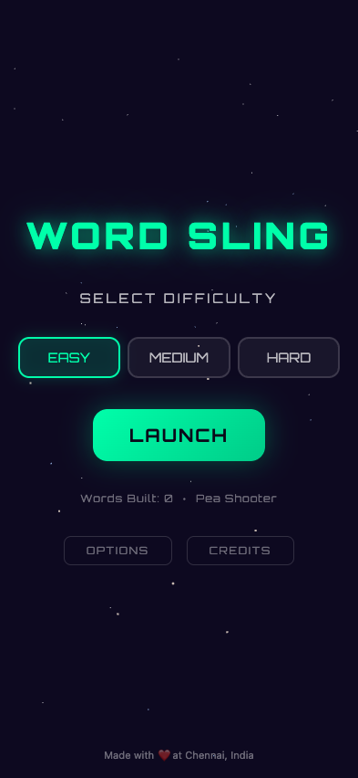
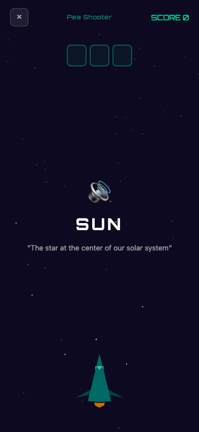
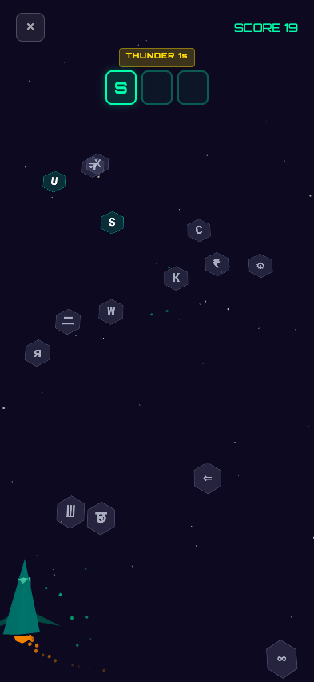
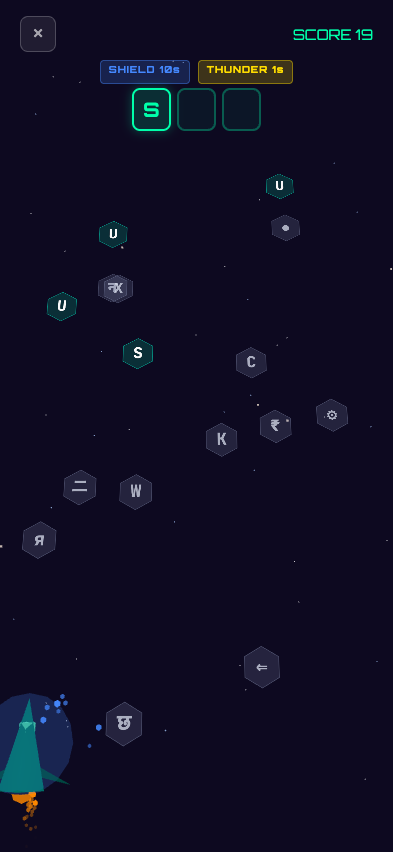
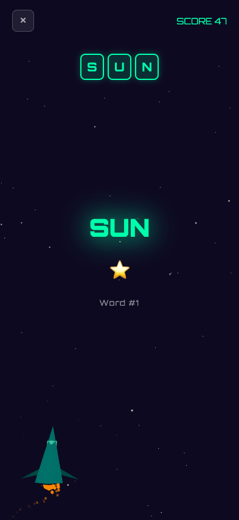
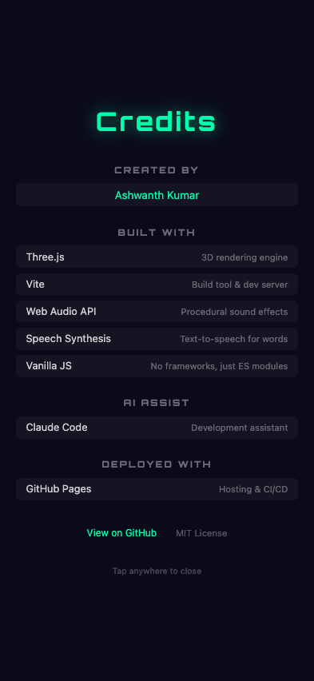

# Word Sling

A mobile-first vocabulary learning game set in space. Steer your spaceship through a rain of characters to collect the right letters and spell words.

**[Play Now](https://ashwanthkumar.github.io/word-sling/)**

## Screenshots

<table>
  <tr>
    <td><br/><em>Start Menu</em></td>
    <td><br/><em>Word Intro</em></td>
    <td><br/><em>Gameplay</em></td>
  </tr>
  <tr>
    <td><br/><em>Shield Power-up</em></td>
    <td><br/><em>Word Complete</em></td>
    <td><br/><em>Credits</em></td>
  </tr>
</table>

## How to Play

1. Choose a difficulty (Easy, Medium, or Hard)
2. Listen to the word and its meaning
3. Swipe/drag to steer your ship and collect letters in order
4. Shoot down obstacles — your gun upgrades as you progress
5. Grab power-ups (boost, shield, thunder) for an edge
6. Complete words to advance through 500 vocabulary words

## Features

- 500 vocabulary words progressing from short to long
- 3 difficulty modes (Easy, Medium, Hard)
- 7 gun levels that unlock at word milestones
- Power-up drops: boost, shield, and thunder
- Text-to-speech reads each word and meaning before gameplay
- Spaced repetition tracks your progress across sessions
- Procedural sound effects via Web Audio API
- 300+ UTF-8 decoy characters (Greek, Cyrillic, Katakana, Devanagari, Runic, and more)
- Three.js space environment with parallax stars and particle effects
- Works on mobile and desktop

## Development

```
npm install
npm run dev
```

## Build

```
npm run build
```

## License

[MIT](LICENSE)
